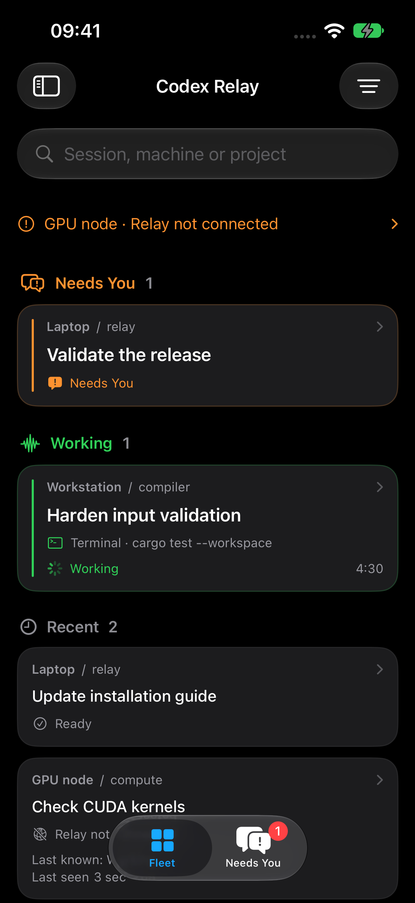
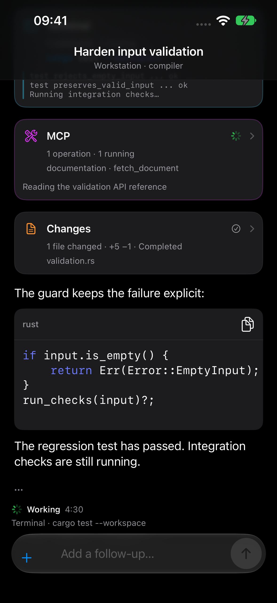
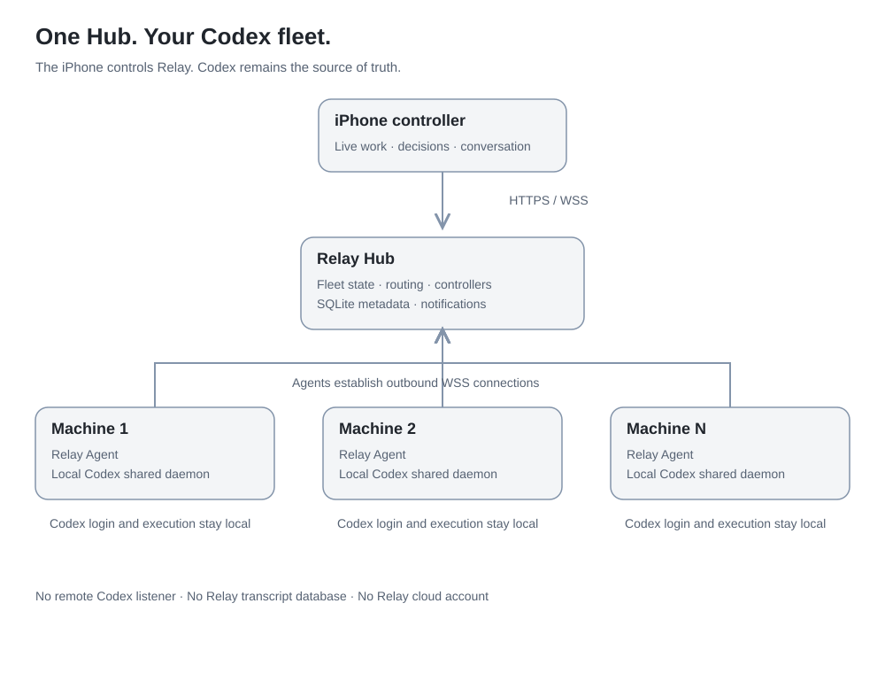
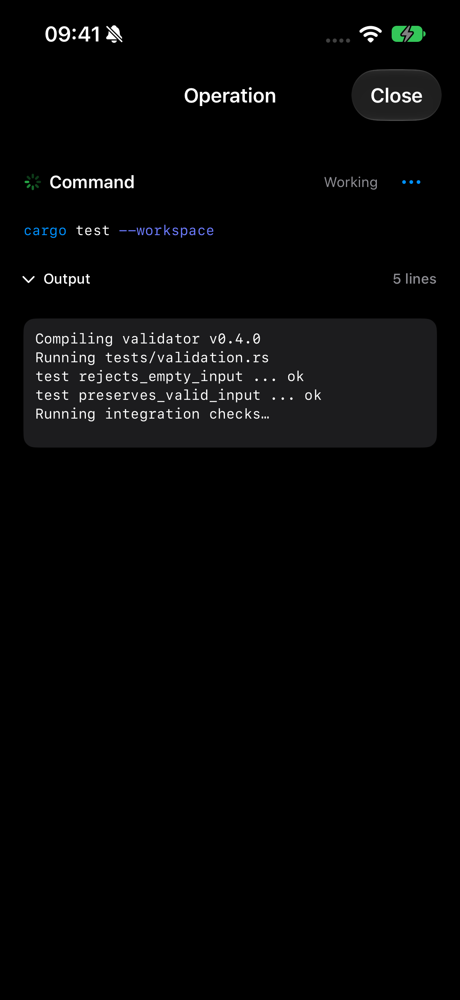
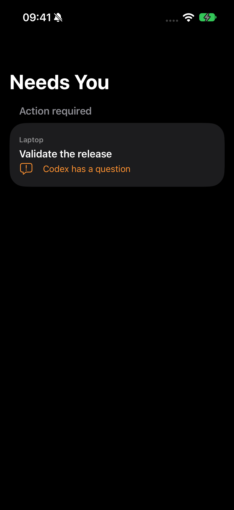
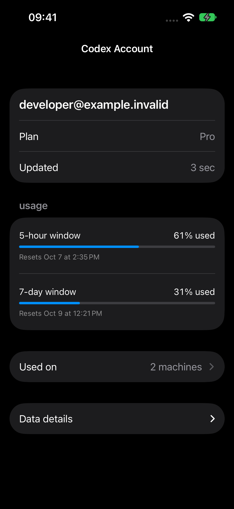

<p align="center"></p>

# Codex Relay

**Your Codex fleet, on iPhone.** A self-hosted control plane for observing,
controlling and continuing Codex sessions across multiple machines.

<p align="center">


</p>

- **Know what is happening now:** live responses, commands, tools, files and diffs.
- **Respond when needed:** one cross-machine Needs You inbox and inline decisions.
- **Continue work:** New Turn when ready, queued Follow-up while working, separate Steer.
- **Trust the state:** explicit Online, Syncing, Degraded and Offline; last-known work stays visibly stale.
- **Understand your fleet:** machines, runtime account usage, controllers and redacted diagnostics.
- **Keep control:** your Hub, your machines, local Codex login, no Relay cloud account.

## How it works



The Hub owns Relay access and routing. **Codex owns threads, conversation,
running turns and the Follow-up queue.** Agents use the existing local shared
Codex daemon; Relay does not expose that daemon over the network. Conversation
and outbox content are bounded and ephemeral, not a Relay transcript database.

[Architecture](docs/architecture/overview.md) · [Protocol](docs/architecture/protocol.md) · [Synchronization](docs/architecture/synchronization.md)

## Quick Start

You need an always-on Linux Hub host with HTTPS/WSS, a machine with an existing
signed-in Codex runtime, and a Mac with Xcode to install the iPhone development
build. Use the Go version in `go.mod` to build the current candidate.

### 1. Install the Hub

Choose an always-on Linux host as the coordinator. On that host, build the
current candidate:

```sh
git clone https://github.com/mothx9/codex-relay.git
cd codex-relay
make build
```

Set `RELAY_HUB_URL` to your actual HTTPS origin and install the user service.
HTTPS/proxy configuration remains yours; Relay does not configure your network.

```sh
./scripts/install.sh hub --binary ./bin/codex-relay \
  --public-url "$RELAY_HUB_URL"
```

Expected: the Hub service is running and reachable at your HTTPS origin. Follow
the [Hub guide](docs/setup/hub.md) for TLS, cross-builds, service lifetime and
advanced installation.

### 2. Pair the iPhone

[Build and install the native app](docs/setup/iphone.md) through Xcode using your
own signing team. On the Hub host, generate a one-time controller code:

```sh
~/.local/bin/codex-relay pair --hub-url "$RELAY_HUB_URL" \
  --data-dir "$HOME/.local/share/codex-relay/hub" --name iPhone
```

Enter the Hub URL and code in the app. The code expires in five minutes; the
bootstrap/admin credential stays on the Hub host.

Expected: Fleet opens. [Pairing walkthrough and screenshot](docs/setup/iphone.md).

### 3. Add a machine

On iPhone, open **Relay menu → Machines → Add a machine** to mint a one-time Agent
code. On the Codex-running machine, install its matching candidate binary:

```sh
./scripts/install.sh agent --binary ./bin/codex-relay \
  --hub-url "$RELAY_HUB_URL" --machine workstation --pair
```

Enter the code at the prompt. The Agent connects outbound and progresses through
Syncing to Online after a fresh Codex snapshot. Existing enrollment is never
silently replaced. [Linux guide](docs/setup/linux-agent.md) · [macOS guide](docs/setup/macos-agent.md).

Expected: the machine appears Online in **Relay menu → Machines**. Its local
Codex login and work stay on that machine.

### 4. Run Codex normally

Keep using Codex on each enrolled machine. Fleet shows active work and requests;
All Sessions provides on-demand historical navigation. A machine going offline
does not mean its previous work completed.



### 5. Control it remotely

Open a session, answer a current request, or send a message. Ready sends a New
Turn; Working queues a Follow-up. Steer and Interrupt stay separate advanced
current-turn actions. Acknowledgement is not completion, and an uncertain outcome
is never automatically resent.

<p>


</p>

## Documentation and support

- [Documentation index](docs/README.md)
- [Upgrading](docs/operations/upgrading.md) and [troubleshooting](docs/operations/troubleshooting.md)
- [Controllers and recovery](docs/architecture/access.md)
- [Account data](docs/architecture/accounts.md) and [notifications](docs/architecture/notifications.md)
- [Native development](docs/development/native-ios.md), [testing](docs/development/testing.md), [releases](docs/development/releases.md)
- [Contributing](CONTRIBUTING.md) and [changelog](CHANGELOG.md)

## Security and compatibility

Relay can control Codex with the local user's privileges. Use trusted HTTPS,
protect controller/machine credentials, and read [SECURITY.md](SECURITY.md).
OpenAI authentication stays on the worker. Push text is private by default;
notification taps navigate and never approve work.

## Current status and distribution

The native app is an Xcode development build. The project remains an explicit
release candidate, with physical push acceptance outstanding. See the canonical
[current status and compatibility](docs/status.md) for validated Codex versions,
iOS distribution, APNs requirements and the distinction between supported pending
RPCs and transient async assistant questions. Pairing and ordinary control work
without APNs. Public screenshots use sanitized production-view fixtures.

Native iOS 17+ supports English and Italian, semantic typography, Dynamic Type,
Reduce Motion, and material fallback where Liquid Glass is unavailable. The
embedded PWA remains a fallback/debug client.

## License

[Apache-2.0](LICENSE). Codex Relay is an independent project and does not use OpenAI's
logo or imply official affiliation.
