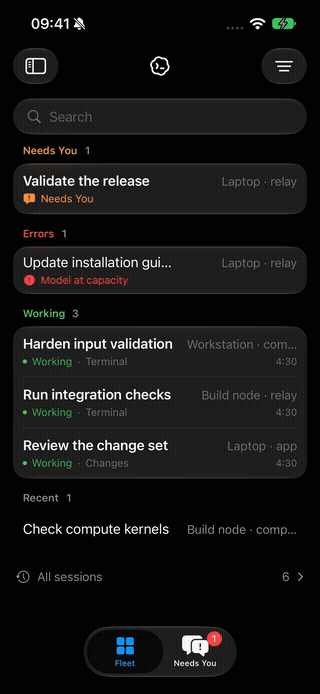

<p align="center">
  <picture>
    <source media="(prefers-color-scheme: dark)" srcset="docs/assets/app/readme-dark.svg">
    
  </picture>
</p>

<p align="center">
  <a href="#quick-start"></a>
  <a href="docs/setup/iphone.md"></a>
  <a href="https://github.com/mothx9/codex-relay/releases/tag/v0.1.0"></a>
  <a href="https://github.com/mothx9/codex-relay/actions/workflows/ci.yml?query=branch%3Amain"></a>
  <a href="LICENSE"></a>
</p>

**Your Codex fleet, on iPhone.** A self-hosted control plane for observing,
controlling and continuing Codex sessions across multiple machines.

[Download v0.1.0](https://github.com/mothx9/codex-relay/releases/tag/v0.1.0) · [Quick Start](#quick-start) · [Documentation](docs/README.md) ·
[Architecture](docs/architecture/overview.md) · [Current status](docs/status.md)

<p align="center">


</p>

## Why Codex Relay

- **Know what is happening now:** live Fleet rows stand out from Recent; execution state stays separate from current activity.
- **Respond when needed:** canonical decisions and clearly separate transient live questions.
- **Continue work:** send a Follow-up, then tap its Steer action to use it in the current turn; attach photos or screenshots with +.
- **Trust the state:** explicit Online, Syncing, Degraded and Offline; last-known work stays visibly stale.
- **Understand your fleet:** machines, runtime account usage, controllers and redacted diagnostics.
- **Stay informed:** native local alerts while connected; remote APNs with your Apple setup.
- **Keep control:** your Hub, your machines, local Codex login, no Relay cloud account.

<p align="center"><a href="docs/assets/app/recordings/native-walkthrough.mp4"></a></p>

[Watch the short native walkthrough](docs/assets/app/recordings/native-walkthrough.mp4)
— actual simulator recording with sanitized example content.

[Activity list](docs/assets/app/screenshots/activity.png) ·
[Changed files](docs/assets/app/screenshots/changed-files.png) ·
[Partial-height live question](docs/assets/app/screenshots/question-panel.png)

## How it works


The Hub owns Relay access and routing. **Codex owns threads, conversation,
running turns and the Follow-up queue.** Agents use the existing local shared
Codex daemon; Relay does not expose that daemon over the network. Conversation
and outbox content are bounded and ephemeral, not a Relay transcript database.

[Architecture](docs/architecture/overview.md) · [Protocol](docs/architecture/protocol.md) · [Synchronization](docs/architecture/synchronization.md)

## Quick Start

You need an always-on Hub host with HTTPS/WSS and an existing signed-in Codex
runtime on each machine. **Download and pair; no clone, Go toolchain or Xcode
required.** [Choose your installation route](docs/setup/downloads.md).

### 1. Install the Hub

On your Linux Hub host, download the installer:

```sh
curl -fL https://github.com/mothx9/codex-relay/releases/download/v0.1.0/install.sh -o install.sh
```

Set `RELAY_HUB_URL` to your actual HTTPS origin and install the user service.
HTTPS/proxy configuration remains yours; Relay does not configure your network.

```sh
sh install.sh hub --public-url "$RELAY_HUB_URL"
```

Expected: the Hub service is running and reachable at your HTTPS origin. Follow
the [Hub guide](docs/setup/hub.md) for TLS, service lifetime and
advanced installation.

### 2. Pair the iPhone

[Download the native IPA](https://github.com/mothx9/codex-relay/releases/download/v0.1.0/CodexRelay-0.1.0-ios-unsigned.ipa)
and sign/install it with AltStore Classic; a free Apple account needs a seven-day
refresh. Follow the [short iPhone guide](docs/setup/iphone.md).
For immediate access without a computer, open your Hub in Safari and use
**Share → Add to Home Screen** for the included web/PWA client.

On the Hub host, generate a one-time controller code:

```sh
~/.local/bin/codex-relay pair --hub-url "$RELAY_HUB_URL" \
  --data-dir "$HOME/.local/share/codex-relay/hub" --name iPhone
```

Enter the Hub URL and code in the app. The code expires in five minutes; the
bootstrap/admin credential stays on the Hub host.

Expected: Fleet opens. [Pairing walkthrough and screenshot](docs/setup/iphone.md).

### 3. Add a machine

On iPhone, open **Relay menu → Machines → Add a machine** to mint a one-time Agent
code. On the Codex-running machine, download the same installer and run:

```sh
curl -fL https://github.com/mothx9/codex-relay/releases/download/v0.1.0/install.sh -o install.sh
sh install.sh agent --hub-url "$RELAY_HUB_URL" --pair
```

Enter the code at the prompt. Its machine ID defaults to the hostname; use
`--machine NAME` if needed. The Agent connects outbound and progresses through
Syncing to Online after a fresh Codex snapshot. Existing enrollment is never
silently replaced. [Linux guide](docs/setup/linux-agent.md) · [macOS guide](docs/setup/macos-agent.md).

Expected: the machine appears Online in **Relay menu → Machines**. Its local
Codex login and work stay on that machine.

### 4. Run Codex normally

Keep using Codex on each enrolled machine. Fleet shows active work and requests;
All Sessions provides on-demand historical navigation. A machine going offline
does not mean its previous work completed.


### 5. Control it remotely

Open a session, answer a current request, or send a message. Ready sends a New
Turn; Working queues a Follow-up. Steer and Interrupt stay separate advanced
current-turn actions. Acknowledgement is not completion, and an uncertain outcome
is never automatically resent.

<p>


</p>

## Documentation and support

- [Documentation index](docs/README.md)
- [Upgrading](docs/operations/upgrading.md) and [troubleshooting](docs/operations/troubleshooting.md)
- [Controllers and recovery](docs/architecture/access.md)
- [Account data](docs/architecture/accounts.md) and [notifications](docs/architecture/notifications.md)
- [Native development](docs/development/native-ios.md), [testing](docs/development/testing.md), [releases](docs/development/releases.md)
- [Contributing](CONTRIBUTING.md) and [changelog](CHANGELOG.md)

## Security and compatibility

Relay can control Codex with the local user's privileges. Use trusted HTTPS,
protect controller/machine credentials, and read [SECURITY.md](SECURITY.md).
OpenAI authentication stays on the worker. Native notifications identify their
source machine/session/turn; a privacy setting hides that metadata. Message and
command contents are never included. Notification taps navigate and never approve work.

## Current status and distribution

**v0.1.0** includes versioned Hub/Agent archives, an unsigned native iPhone IPA,
the installer, checksums and a source manifest. Xcode is part of the development
path. TestFlight/App Store distribution is not available yet; the IPA needs
signing with your own account. See [current status and compatibility](docs/status.md)
for validated Codex versions, native APNs requirements and pending/live-question
behavior. Pairing and ordinary control work without APNs. Screenshots and the
recording use sanitized production-view fixtures.

Native iOS 17+ supports English and Italian, semantic typography, Dynamic Type,
Reduce Motion, and material fallback where Liquid Glass is unavailable. The
embedded PWA remains a fallback/debug client.

## License

[Apache-2.0](LICENSE) for Relay source. Codex Relay is an independent project, not
an official OpenAI application. The native Codex icon is attributed separately in
[product assets](docs/assets/app/README.md).
