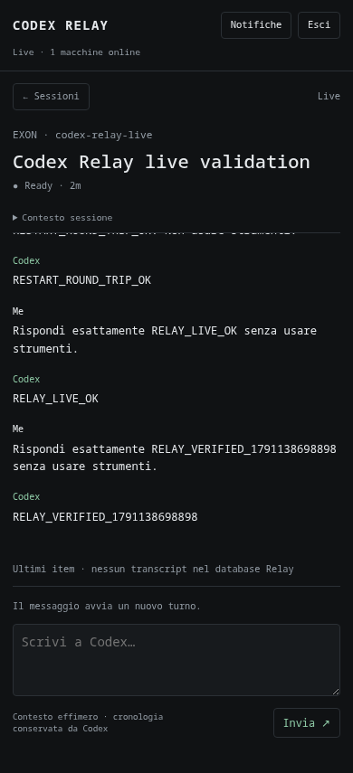

# Codex Relay

A personal control plane for Codex sessions on multiple machines. Codex does the work on each host; Relay transports control, derived state and notifications. One Go binary contains the hub, outbound agent and browser PWA. The hub needs no Node runtime, GPU or external database.

**Status: v0.1.0-rc.3.** The canonical composer and ephemeral follow-up lifecycle run against real Codex 0.160.0. The reference deployment has one always-on hub on Zima, with Exon, Spark and MacBook as agents. The actual Zima cutover and physical iPhone push acceptance remain unverified; the current Exon loopback hub is validation/rollback only. See [VALIDATION.md](VALIDATION.md) for evidence and limits.

Codex Relay is an independent project, not affiliated with or endorsed by OpenAI. Apache-2.0 licensed. No OpenAI logos are used.

```text
 iPhone / Browser
       |
   HTTPS + WSS
       |
 Relay Hub (Zima)  -- outbound HTTPS --> browser push service
       ^
       | outbound authenticated WebSockets
       +--------------+--------------+
       |              |              |
    Agent Exon    Agent Spark    Agent MacBook
       |              |              |
    local Codex    local Codex    local Codex
    app-server    app-server     app-server
```

The fleet view has status filters, search, grouping by status/machine/project, and keyboard navigation (`j/k`, arrows, Enter, Esc, `g`, `/`). Session detail has recent context, live output and contextual approval/input forms. At READY, **Invia** starts a new turn. At WORKING, **Invia follow-up** uses Codex's native queue; the message appears immediately and remains visible until reconciled with its canonical userMessage. At NEEDS_YOU, answer the displayed request. **Steer turno corrente** and **Interrompi turno** are separate advanced actions, gated by explicit adapter capabilities and an active turn ID. Saved inactive threads are read-only until explicitly attached.

The existing screenshot predates the canonical composer; the updated control flow is described above.



## Quick start: localhost

Install Go 1.27 and Codex CLI 0.160.0 or the matching managed daemon. Sign in to Codex normally; Relay never reads or transmits its login tokens.

```sh
git clone https://github.com/mothx9/codex-relay.git
cd codex-relay
make build
# A running hub must be stopped before starting another on the same port.
codex --version
codex app-server daemon version
# Only if the shared daemon is not running:
codex app-server daemon start

# Terminal 1: local development only
./bin/codex-relay hub
```

In another terminal:

```sh
./bin/codex-relay token add --machine exon --out .relay/exon.token
./bin/codex-relay agent --hub-url http://127.0.0.1:8787 \
  --insecure-http --machine exon --name EXON --token-file .relay/exon.token
```

Open `http://127.0.0.1:8787`. Use the token file path shown by the active hub at startup; the default is `.relay/hub/admin.token`. Copy its contents locally and enter them in the login form. A separate hub/data directory has a different token. A port conflict now fails before generating new credentials. It is exchanged for an HttpOnly session cookie; it is never put in browser storage. Do not paste tokens into chat, screenshots or source files.

Create/run a normal Codex thread locally, then select it in Relay. The UI shows actual Codex state. A brand-new zero-turn thread cannot be resumed until Codex has materialized its first rollout: run its first message locally. No synthetic sessions are inserted into the application.

## Hub

```sh
codex-relay hub --listen 127.0.0.1:8787 \
  --public-url "${RELAY_HUB_URL:?Set the actual HTTPS hub URL first}" \
  --data-dir "$HOME/.local/share/codex-relay/hub" \
  --push-subject mailto:operator@example.net
```

Serve the local listener through an existing HTTPS reverse proxy. `--public-url` is the exact browser-facing origin, including port if applicable; subpath mounting is unsupported. The reverse proxy must support WebSocket upgrade on `/api/ui` and `/api/agent`. Direct TLS is available with `--tls-cert` and `--tls-key`.

Plain HTTP is accepted on loopback for development. Any non-loopback plaintext use or non-local HTTP public origin requires the explicit `--insecure-http` flag. Production uses HTTPS/WSS. Do not expose Codex's own app-server socket or port to the Internet.

Data directory files are a metadata-only SQLite DB (WAL), bootstrap operator token and VAPID keys. Keep it private and back it up. The database contains machines, capped session metadata, pending request routing IDs, operator/agent token hashes, push subscriptions, bounded audit and notification dedupe. It has no conversation table. Pending operation text, request payloads and answers are never persisted.

## Agent

```sh
codex-relay agent --hub-url "${RELAY_HUB_URL:?Set the actual HTTPS hub URL first}" \
  --machine spark --name SPARK --token-file "$HOME/.config/codex-relay/spark.token"
```

Use the same OS user as local Codex. By default the agent connects to the **existing shared daemon**, via a WebSocket handshake over `$CODEX_HOME/app-server-control/app-server-control.sock` (otherwise `~/.codex/...`). It does not start/restart that daemon. A missing daemon produces a degraded machine and retry, rather than an invented session.

The hub URL can use LAN, Tailscale or any working routing. Relay does not implement a VPN or change networking. Agents require distinct per-machine tokens and only open outbound connections.

Options: `--codex /absolute/path/to/codex`, `--codex-socket /path`, or `--codex-url ws://127.0.0.1:PORT` with optional local `--codex-token-file`. Codex TCP endpoints are restricted to loopback. All token/key files must be regular files with permissions 0600.

`--private-codex` explicitly supervises a private stdio app-server, for installations where shared access is unavailable. It cannot observe the live runtime or pending requests of an independent TUI/desktop process. Stored threads remain read-only until explicitly resumed in that private server; avoid simultaneously running the same thread in another process. A private agent restart also restarts its owned Codex process. Prefer the shared daemon. See [DISCOVERY.md](DISCOVERY.md).

## Operator and machine access

Provision tokens **on the hub** and copy them through a trusted channel:

```sh
codex-relay token add --data-dir "$HOME/.local/share/codex-relay/hub" \
  --machine macbook --out "$HOME/macbook.token"
# Securely copy to the target, then remove this staging file.
codex-relay token revoke --data-dir "$HOME/.local/share/codex-relay/hub" --machine macbook
```

Revocation rejects new commands immediately and closes existing agent connections within 15 seconds. `token add` for an existing machine rotates its token; it never overwrites the output file. The operator bootstrap token grants full control; protect it as a privileged credential. Logout invalidates that browser session and closes its WebSockets. Operator sessions expire after 12 hours.

## iPhone PWA and Web Push

1. Open the production **HTTPS** hub in Safari, then Share → Add to Home Screen.
2. Launch Codex Relay from the Home Screen and sign in.
3. Open **Notifiche**, keep privacy enabled if desired, and tap **Abilita Web Push**.
4. Accept iOS's notification permission, then use **Invia prova**.
5. Close the PWA and provoke a real approval/input request from local Codex. Tap the notification to open `/session/<machine~thread>`; sign in again if the operator cookie has expired.

Home Screen web apps support Web Push on iOS/iPadOS 16.4+; permission must follow a user gesture. No Apple Developer account is required. [WebKit's primary documentation](https://webkit.org/blog/13878/web-push-for-web-apps-on-ios-and-ipados/).

The hub generates VAPID keys on first start. Keep these keys stable across upgrades. Agents have no push code. Subscription registration/removal requires operator authentication and Origin/CSRF validation. Privacy defaults to generic lock-screen text; disabling it adds machine/project names, never a command or prompt. Subscriptions remain active independently of the UI's WebSocket and login cookie so push can wake the closed PWA.

Notifications are limited to pending attention, completed/failed turns and sustained machine offline state. High-frequency output/deltas do not notify. Session tags replace obsolete notifications; persisted semantic dedupe prevents request replay spam. Offline notifications have a one-minute grace. Push has a bounded queue; delivery is best effort and service failures are logged without endpoints or content. HTTP 404/410 subscriptions are removed. The hub needs outbound HTTPS to Apple (`*.push.apple.com`), Google FCM or Mozilla's push service; registration endpoints are allowlisted.

The headless Chromium available during validation denied real subscription registration. VAPID signing/encryption, dedupe, expiry, privacy and deep-link payloads are tested, but physical iPhone receipt and notification tap must be confirmed on your installed PWA. `Invia prova` opens the fleet; real session notifications deep-link to that session.

## Install as a service

Published prerelease binaries target Linux amd64, Linux arm64 and macOS arm64, with checksums. No Go or Node runtime is needed to run Relay. `scripts/install.sh` downloads and verifies the matching binary, or accepts `--binary /path/to/prebuilt/binary`. It installs under `~/.local/bin`, not as root. `--dry-run` prints the service definition without changing files or services. Linux's `--no-start` installs files and reloads systemd without enabling or starting the unit; use it while preparing the configured endpoint.

First provide a working HTTPS endpoint and set `RELAY_HUB_URL` to its exact URL. Then create distinct agent tokens on that hub and securely copy them to their target machines. Cloning the repository does not perform enrollment. Missing tokens and documentation placeholder domains fail before service installation.

```sh
# Linux hub, with an existing HTTPS proxy:
./scripts/install.sh hub --public-url "${RELAY_HUB_URL:?Set the actual HTTPS hub URL first}"

# Linux/macOS agent, after copying its token:
./scripts/install.sh agent --hub-url "${RELAY_HUB_URL:?Set the actual HTTPS hub URL first}" \
  --machine exon --token-file "$HOME/exon.token"
```

Linux uses systemd user units. For always-on operation after logout run `sudo loginctl enable-linger "$(id -un)"`. Inspect with `systemctl --user status codex-relay-hub` or `journalctl --user -u codex-relay-agent`. macOS uses `~/Library/LaunchAgents/net.codex-relay.agent.plist`, automatically restarts after process exit, and reconnects after sleep/wake; it runs while that user is logged in. Logs are in its private state directory. Codex's daemon should be installed/started through Codex's own supported commands.

See [DEPLOYMENT.md](DEPLOYMENT.md) for exact Zima/Exon/Spark/MacBook commands, token transfer and a recommended Tailscale Serve setup. No network setup is performed by the installer.

## Recovery and chat lifetime

The agent keeps its Codex connection while the hub is unavailable. Both WebSocket links have bounded queues. Slow consumers are disconnected instead of accumulating unbounded output. Reconnect uses exponential backoff with jitter. After reconnect the agent reconstructs its snapshot from Codex, including replayed pending requests; the hub trusts that snapshot over old derived state. Commands are not silently retried: an interrupted command reports an unknown outcome, so inspect the real thread before resubmitting.

The follow-up outbox is browser RAM only: up to 32 unmaterialized messages / 128 KiB, with at most 128 entries including correlation metadata. It is cleared on logout, page exit or five minutes in the background; inactive entries have a five-minute TTL. A successful queue RPC means **QUEUED**, never turn completion. Codex userMessage `clientId` reconciles the optimistic bubble without text guessing. Explicit Retry preserves user choice; a lost outcome never causes automatic resubmission. Opening a session also reads its bounded native Codex queue.

Chat is fetched on session open with a descending `thread/items/list` page (40 items), then streams live. Each recent buffer is capped at 50 items / 128 KiB, with at most 64 hub buffers and a five-minute TTL. Closing the last viewer removes its buffer. Unwatched completion drops its buffer. The browser caps the same recent context, clears it on close/background expiry, and stores no transcripts in localStorage, IndexedDB or its service-worker cache.

## Doctor and validation

```sh
codex-relay doctor --hub-url "${RELAY_HUB_URL:?Set the actual HTTPS hub URL first}" \
  --machine exon --token-file "$HOME/.config/codex-relay/exon.token"
make check
make cross
```

Doctor reports CLI/daemon adapter connectivity, session count, hub reachability, current machine WebSocket status, read-only DB quick-check, VAPID file presence and its own runtime memory. Its memory value is **not** the RSS of a running hub or agent.

CI checks gofmt, vet, race-tested Go unit/integration tests, the ES-module control-flow tests, and all three target builds. Development control-flow tests need Node; the installed hub and agents do not. Fake app-server/backend tests require no Codex account. Optional real daemon tests are excluded from normal CI:

```sh
RELAY_REAL_CODEX=1 go test ./internal/codex -run TestRealCodexDiscovery -v
# Creates and archives one isolated thread; consumes two very small turns:
RELAY_REAL_CODEX_TURN=1 go test ./internal/codex -run TestRealCodexRoundTrip -v
```

## Limits and next compatibility work

- Verified CLI/daemon: 0.160.0 on Linux amd64, with native discovery also exercised on Linux arm64 and macOS arm64. The protocol is experimental; other versions are unverified. Keep upgrades deliberate and run doctor/optional tests.
- Resume is the live subscription boundary. There is no separate `thread/subscribe` or `serverRequest/list`; the shared server replays pending requests on resume.
- 16 machines, 256 recent sessions per agent, 1024 fleet sessions, 32 operator sockets, 32 push subscriptions, 128 pending requests/in-flight commands. These are deliberate v0.1 bounds.
- Unloaded historical threads show INACTIVE/read-only. Relay cannot infer activity of a separate non-shared Codex process. No TUI scraping, ANSI parser or PTY controller is used.
- File approval is disabled when proposed file context is missing. Permission grants are explicitly turn-scoped; persistent/session grants and execution-policy amendments are not exposed.
- MCP form input uses an explicit JSON response; URL elicitations require local Codex. Legacy/dynamic requests are shown as requiring local handling. These paths have contract tests, not full live acceptance coverage.
- No creation of new Codex projects, remote file browser, multi-user policies or autonomous orchestration. Local Codex remains the source of truth.
- Canonical Zima hub/Wi-Fi, the three agents connected to that hub, MacBook launchd/reconnect, real Zima resource measurements and physical iPhone push/deep-link acceptance remain to be verified. ARM64/macOS binaries and Codex discovery have run on the real hosts; Spark's service is staged, inactive.

Compatibility fixtures for Codex upgrades and release automation are later work. Coordinator AI, native Swift clients, additional backends, fleet policies and YAI integration remain outside v0.1.
