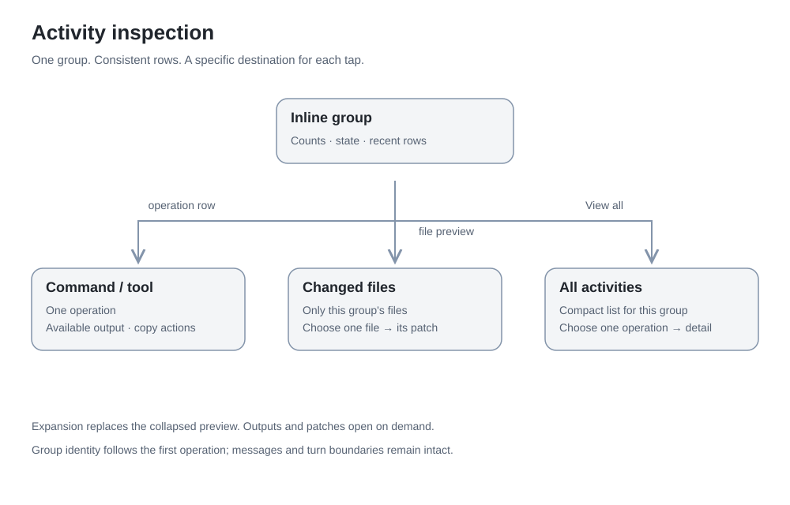

# Native navigation

Each entity has one home. Other views show compact relationships or exceptions,
then navigate to that home; they do not embed another management inventory.

| Home | Responsibility |
| --- | --- |
| Fleet | Needs You, current work, bounded recent work; search and All Sessions |
| Needs You | Canonical pending RPC decisions and a distinct transient Live Questions section |
| Machines | Inventory, connection/runtime state, access management |
| Machine → Diagnostics | Heartbeat, epoch, sequence, snapshot and adapter measurements |
| Codex Accounts | Runtime identity, plan, dynamic windows and supported quota data |
| Controllers & Access | Authorized controllers, enrollment, revocation and local sign-out |
| Diagnostics | Hub/system health, aggregate state, transport timing, redacted copy |
| Settings | Hub configuration/access context, notification preferences and About |
| Session | One conversation, current heartbeat, composer and activity inspection |

## Navigation choice

The previous Fleet / Needs You / Settings three-tab model was compared visually
with two work tabs and a native Relay administration sheet on iPhone 16. The
latter is retained: Fleet and Needs You remain one-handed, persistent work routes;
less-frequent administration is one menu away. A sheet preserves spatial context
without introducing a custom drawer or presenting Settings as current work.
Administrative navigation disappears inside a session.

The Relay menu links to Machines, Accounts, All Sessions, Controllers, Diagnostics
and Settings. Settings does not repeat those administrative destinations. Account
“Used on” opens a filtered version of the canonical Machines view. Global
Diagnostics links to Machines, while per-machine measurements live in its detail.

## Quiet normal state

A healthy Fleet has no permanent connected/count banner. Connection exceptions
produce one actionable warning leading to Machines. At ordinary text sizes a
Working row has two lines: title and machine/project, then activity category and
elapsed time. Terminal, Changes, Tools, response generation and context compaction
use a gray-to-green text sweep. Reduce Motion shows steady green. Full shell
bodies stay in the session; completed activity never masquerades as a running
operation. Needs You stays orange, failures red, and stale connectivity explicit.
Accessibility text sizes use a vertical layout so identity remains readable.

Sections use open rows on the system canvas, with quiet headings and separate
Working and Recent lists. Working order follows turn-start identity rather than
every live timestamp update. Recent rows omit a repeated Ready label. Needs You
and the Relay menu use the same title-first open-list hierarchy. Glass belongs to
search, navigation and composer controls, not to opaque conversation content.

Consecutive command/tool/file activity in the same turn shares one stable inline
group between conversational messages. The header and its children use one icon
column and one text column; expansion replaces the collapsed preview. Groups over
five items explicitly label their bounded preview as Latest activities.

| Action | Destination |
| --- | --- |
| Group chevron | Expand/collapse recent compact activity rows in place |
| Command/tool row, collapsed or expanded | That operation and its available output |
| One file preview | That file's patch |
| Multiple file preview | Changed files list; each file opens its own patch |
| View all activities | Compact list for exactly that group; tap one row for detail |

The aggregate does not eagerly expand every output or patch. Tool rows include
the source/server alongside the tool name, so `js` is not presented without context.
No route merges operations across conversational messages or turn identities.

The compact jump-to-latest button does not change reader-intent scroll rules:
streaming, keyboard changes and drag inertia never imply permission to force-scroll.

[Navigation](../assets/app/screenshots/navigation.png) ·
[Settings](../assets/app/screenshots/settings.png) ·
[Machine diagnostics](../assets/app/screenshots/machine-diagnostics.png)

The composer is one material surface with integrated 44-point controls. Session
Info belongs to the header; Steer/Interrupt remain in an anchored composer action
panel. The composer and keyboard remain visible when it opens. Copy Session Link
and duplicate send actions are absent; queued-message editing appears only when
supported. The panel clears when the current turn or connection changes. A compact
neutral Working text sweep respects Reduce Motion and does not animate transcript
updates. Context compaction replaces the Working label only while a real current
compaction item is running; the last command is not repeated below the heartbeat.

Short current live questions open at the medium sheet detent on a material surface,
with a drag handle and a large detent available. Long or multiple questions and
accessibility text sizes open large. There is still only one composer-side reply
home; selection prepares an answer without sending. Canonical pending RPCs keep
their separate authoritative lifecycle.

Typography uses iOS system text styles and Dynamic Type. Code blocks use the
13-point footnote monospaced role at the standard size, below 17-point body prose.
OpenAI Sans is described in the [official brand guidelines](https://openai.com/brand/),
but its download portal requires access. No private app font has been extracted
or bundled; the native system family remains explicit.
