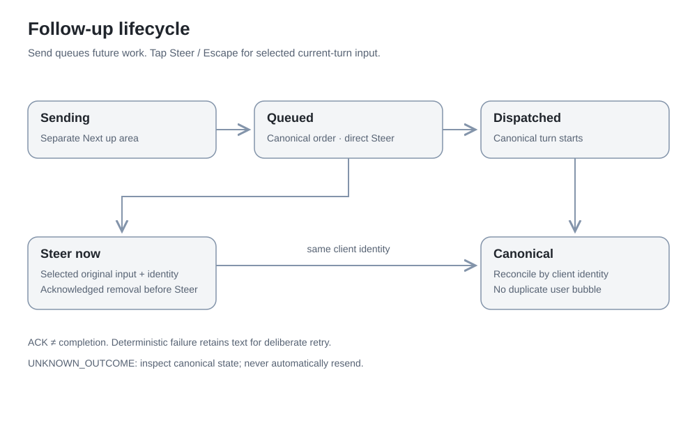
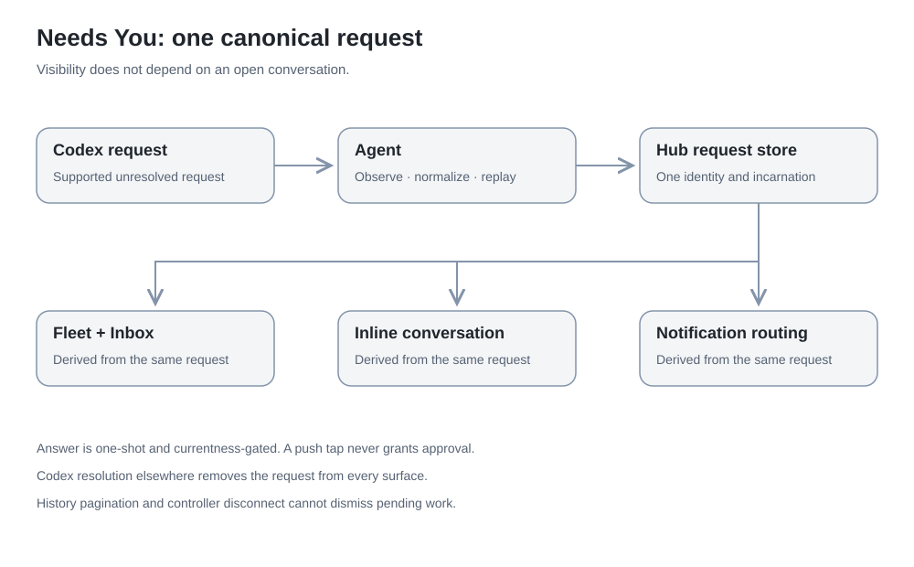

# Architecture

Codex Relay is a self-hosted control plane for observing, controlling and
continuing Codex sessions across machines. The native iPhone controller is the
primary interface; the embedded web/PWA client remains a fallback.

## Roles and ownership

| Component | Owns | Does not own |
| --- | --- | --- |
| Hub | Fleet/control metadata, enrollment, authorization, routing, push | Codex login, model execution, durable conversation |
| Agent | Local adapter connection, synchronization, bounded in-flight results | A second fleet database or public runtime listener |
| Codex runtime | Threads, transcript, turns, queue, pending execution state | Relay controller credentials |
| iPhone | Keychain credential, current presentation, ephemeral draft/outbox | A transcript archive or Codex login |

Agents connect outbound to the Hub over WSS. Each uses its existing local Codex
shared daemon. The Hub never directly opens a remote Codex socket. An always-on
Linux host, Linux workstation, GPU node and macOS laptop are roles, not required
hardware or network products. Relay neither requires nor configures Tailscale.

## State and events

A connected socket first becomes **Syncing**. A current accepted snapshot,
including pending-request replay, makes a machine **Online**. Offline preserves
last-known Codex state; it never fabricates Ready. Epoch, connection identity,
sequence and snapshot watermarks prevent stale writers and replay regression.
See [the synchronization contract](synchronization.md).

Operational summaries go to Fleet. Conversation, command output and request
context go to the controller watching that session. The Hub holds bounded
RAM-only context and fetches history on demand from Codex. Historical session
pages do not subscribe every old thread or replace canonical live state.

## User actions

Ready send starts a new turn. Working send adds a **Follow-up** to Codex's queue.
Steer targets the current turn and requires its observed identity. Interrupt is
separate. A command ACK is not completion: canonical events reconcile the UI by
identity, never matching text. Unknown outcomes are not automatically resent.

Needs You derives from one canonical Hub request store. Fleet, Inbox, inline
forms and notification routing share it. Resolution elsewhere removes the same
request; a page boundary or disconnected controller cannot dismiss it.

## Accounts, access and notifications

[Account metadata](accounts.md) comes from each already-authenticated Codex
runtime through a typed allowlist. The Hub derives account aggregation and
freshness; OpenAI login credentials never leave the worker.

The Hub administrator owns the installation. Paired controllers have the current
single-user control authority; there is no Relay cloud account or invented
Owner credential tier. See [access and recovery](access.md).

The Hub sends privacy-preserving [notifications](notifications.md). Notification
taps only navigate; current authenticated canonical state decides whether a
request is actionable. APNs capability, iOS permission and device registration
are independent states.

## Code boundaries

`internal/codex` contains Codex app-server RPC/schema mapping. `internal/protocol`
defines Relay's wire model. `internal/agent` synchronizes and executes routed
commands; `internal/hub` admits state and authorizes control. `native/RelayCore`
reduces canonical state; `native/iOS` presents it. `web` is embedded by the Go
binary. See the [provider boundary audit](provider-boundary.md).
