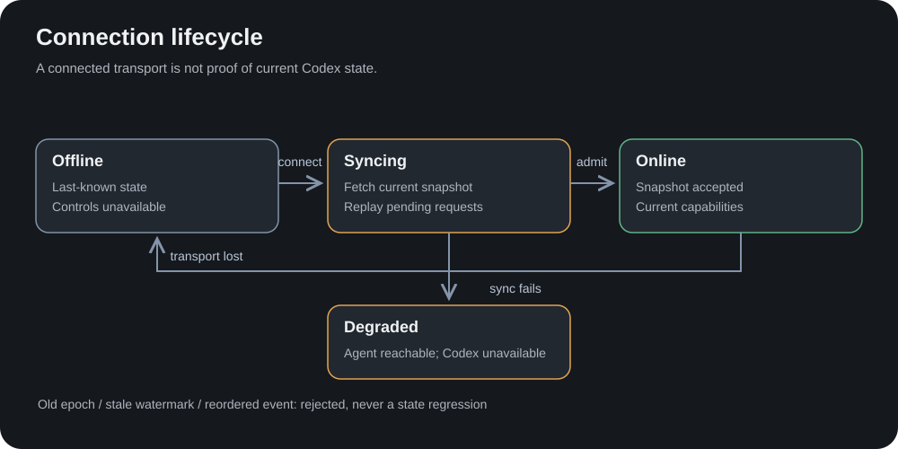

# Relay canonical protocol

Relay protocol version **1** is distinct from the Codex app-server schema.
`internal/protocol` is the wire authority. Clients consume Relay semantics;
Codex method names belong inside `internal/codex`.

## Authentication and transport

All normal traffic uses HTTPS/WSS. The Hub's configured public origin must match
its reverse proxy. Agents use `/api/agent` with `Authorization: Bearer …` and
`X-Relay-Machine`; browser Origin is rejected. Controllers use `/api/ui`, with a
paired operator credential for native clients or a valid cookie and exact Origin
for browsers. HTTP mutations use JSON, matching Origin and `X-Relay-CSRF: 1`.
Do not put reusable credentials in URLs. See [security](../../SECURITY.md).

Messages are JSON envelopes with `type`; protocol structures carry additive
fields. WebSocket ordering alone does not admit state from a replaced peer.
Unsupported versions fail admission. Unknown optional fields must not grant
capabilities or bypass action gating. Maximum message size is 1 MiB.

## Agent handshake and synchronization

| Message | Direction | Purpose |
| --- | --- | --- |
| `announce` | Agent → Hub | Version, machine/runtime/capability metadata, epoch, complete session/request snapshot and watermark/revision |
| `heartbeat` | Agent → Hub | Liveness without fabricated Codex state |
| `event` | Agent → Hub | Sequenced canonical change, scoped machine/session/item/request identities |
| `command` | Hub → Agent | Authorized operation with command ID and preconditions |
| `result` | Agent → Hub | Correlated acknowledgement/error/read result; not inferred turn completion |

Transport acceptance publishes Syncing. Snapshot validation and durable metadata
commit precede Online. Adapter failure publishes Degraded. Old connections,
wrong epochs, duplicate/reordered sequences and stale snapshot revisions cannot
regress accepted state. Covered events are not applied twice. The detailed
[epoch/watermark/reconnect rules](synchronization.md) are normative for this
implementation.

## Controller stream

The Hub sends an initial `snapshot` containing machines, sessions and pending
routing. Controllers send `watch` with `session_id` and optionally a correlated
`history_request_id`; an empty session closes the watch. Watching hydrates recent
history and private `pending` context. Fleet snapshots omit sensitive request
payloads; enrichment preserves request incarnation and form identity.

`event` carries `event_id`, `machine_id`, `session_id`, `epoch`, `sequence`, Agent
observation time and Hub receipt time. Operational activity boundaries update
Fleet summaries. Assistant/command deltas, tool progress and file patches retain
item identity and reach watchers without waiting for completion. Raw upstream
method labels are diagnostic metadata, never client dispatch instructions or
user-visible labels. [Event audit](../live-event-audit.md) lists supported mappings.

## Commands, results and uncertainty

Commands contain a unique `id`, semantic `kind`, session identity and optional
turn/request/queue identity. New Turn, Follow-up, Steer, Interrupt, Answer,
Attach, History and Catalogue are separate operations. Control requires current
Online state and advertised capability; the adapter rechecks Codex state.

Follow-up creation/editing uses canonical queue and client identity. Queue edits
include observed identity/revision, preserve the queue entry and never emulate
editing by delete-and-resend. Codex's current queue update RPC does not offer an
atomic cross-client content CAS; the UI must preserve attempted text on a race.

Results correlate command ID and include `ok`, `error_code`, `retryable`, and
operation-specific payload. A successful ACK does not remove an optimistic
message until the canonical user-message identity arrives. `TURN_CHANGED`
retains attempted Steer text; it does not become Follow-up. `UNKNOWN_OUTCOME`
requires inspection, never automatic retry. Duplicate answer attempts are blocked
by the Hub and adapter; Codex resolution remains authoritative.

## Compatibility and persistence

Add fields with absent-value semantics and tests for older payloads. Do not
interpret missing account windows as zero usage, missing freshness as proof of
liveness, or an unknown request kind as approval permission. Protocol migrations
must coordinate Hub, Agents, native and PWA clients.

SQLite persists enrollment/control metadata and pending routing, not transcripts,
request bodies, tool output or answers. High-frequency events and diagnostics
remain bounded in memory. Hub restart starts machines Offline and rehydrates
through Agent/Codex synchronization. Controller reconnect never replays an
uncertain mutation.
