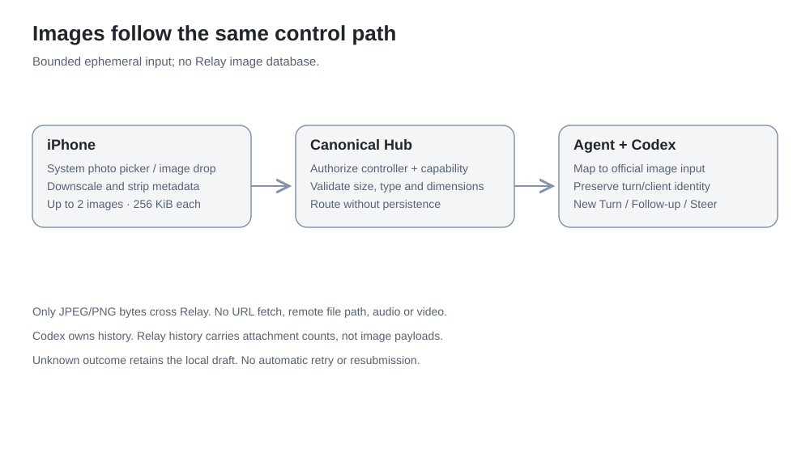

# Relay canonical protocol

Relay protocol version **1** is distinct from the Codex app-server schema.
`internal/protocol` is the wire authority. Clients consume Relay semantics;
Codex method names belong inside `internal/codex`.

## Authentication and transport

All normal traffic uses HTTPS/WSS. The Hub's configured public origin must match
its reverse proxy. Agents use `/api/agent` with `Authorization: Bearer …` and
`X-Relay-Machine`; browser Origin is rejected. Controllers use `/api/ui`, with a
paired operator credential for native clients or a valid cookie and exact Origin
for browsers. HTTP mutations use JSON, matching Origin and `X-Relay-CSRF: 1`.
Do not put reusable credentials in URLs. See [security](../../SECURITY.md).

Messages are JSON envelopes with `type`; protocol structures carry additive
fields. WebSocket ordering alone does not admit state from a replaced peer.
Unsupported versions fail admission. Unknown optional fields must not grant
capabilities or bypass action gating. Maximum message size is 1 MiB.

## Agent handshake and synchronization

| Message | Direction | Purpose |
| --- | --- | --- |
| `announce` | Agent → Hub | Version, machine/runtime/capability metadata, epoch, complete session/request snapshot and watermark/revision |
| `heartbeat` | Agent → Hub | Liveness without fabricated Codex state |
| `event` | Agent → Hub | Sequenced canonical change, scoped machine/session/item/request identities |
| `command` | Hub → Agent | Authorized operation with command ID and preconditions |
| `result` | Agent → Hub | Correlated acknowledgement/error/read result; not inferred turn completion |

Transport acceptance publishes Syncing. Snapshot validation and durable metadata
commit precede Online. Adapter failure publishes Degraded. Old connections,
wrong epochs, duplicate/reordered sequences and stale snapshot revisions cannot
regress accepted state. Covered events are not applied twice. The detailed
[epoch/watermark/reconnect rules](synchronization.md) are normative for this
implementation.

## Controller stream

The Hub sends an initial `snapshot` containing machines, sessions and pending
routing. Controllers send `watch` with `session_id` and optionally a correlated
`history_request_id`; an empty session closes the watch. Watching hydrates recent
history and private `pending` context. Fleet snapshots omit sensitive request
payloads; enrichment preserves request incarnation and form identity.

`event` carries `event_id`, `machine_id`, `session_id`, `epoch`, `sequence`, Agent
observation time and Hub receipt time. Operational activity boundaries update
Fleet summaries. Assistant/command deltas, tool progress and file patches retain
item identity and reach watchers without waiting for completion. Raw upstream
method labels are diagnostic metadata, never client dispatch instructions or
user-visible labels. [Event audit](../development/validation/live-event-audit.md) lists supported mappings.

## Commands, results and uncertainty

Commands contain a unique `id`, semantic `kind`, session identity and optional
turn/request/queue identity. New Turn, Follow-up, Steer, Queue Steer, Interrupt, Answer,
Attach, History and Catalogue are separate operations. Control requires current
Online state and advertised capability; the adapter rechecks Codex state.

Follow-up creation/editing uses canonical queue and client identity. Queue edits
include observed identity/revision, preserve the queue entry and never emulate
editing by delete-and-resend. Codex's current queue update RPC does not offer an
atomic cross-client content CAS; the UI must preserve attempted text on a race.

The optional `can_steer_queue` capability enables `queue_steer` for a selected
queued identity/revision and expected active turn. The Agent compares the full
queued input (including images), then waits for an acknowledged
`thread/queue/delete` before `turn/steer`, using the original input and client ID.
These are two official mutations, not an atomic upstream operation. Another
client can change the queue between the read and deletion; upstream does not
provide a cross-client content CAS. An uncertain deletion never proceeds to Steer.
`queue_removed` distinguishes an acknowledged removal followed by a rejected
Steer, so the native outbox retains recoverable text/images rather than silently
re-enqueueing them. Late queue snapshots cannot resurrect a confirmed removal.
The rest of the queue is untouched. See the
[official queue protocol](https://github.com/openai/codex/blob/main/codex-rs/app-server-protocol/src/protocol/common.rs).

Results correlate command ID and include `ok`, `error_code`, `retryable`, and
operation-specific payload. A successful ACK does not remove an optimistic
message until the canonical user-message identity arrives. `TURN_CHANGED`
retains attempted Steer text; it does not become Follow-up. `UNKNOWN_OUTCOME`
requires inspection, never automatic retry. Duplicate answer attempts are blocked
by the Hub and adapter; Codex resolution remains authoritative.

## Compatibility and persistence

Add fields with absent-value semantics and tests for older payloads. Do not
interpret missing account windows as zero usage, missing freshness as proof of
liveness, or an unknown request kind as approval permission. Protocol migrations
must coordinate Hub, Agents, native and PWA clients.

SQLite persists enrollment/control metadata and pending routing, not transcripts,
request bodies, tool output or answers. High-frequency events and diagnostics
remain bounded in memory. Hub restart starts machines Offline and rehydrates
through Agent/Codex synchronization. Controller reconnect never replays an
uncertain mutation.

## Pending RPCs versus assistant questions

Supported pending server RPCs own request identity and one-shot resolution. The
Hub's canonical pending store feeds Fleet, Inbox, inline forms and notifications.
An assistant `agentMessage.questions` payload is conversation content, not such a
request. In validated upstream 0.160.1, async-question currentness is client-local;
no shared authoritative pending list/resolution lifecycle is exposed. Replaying
history cannot add Needs You entries. Native live hints are bounded presentation
state and expire with stream/turn changes, without claiming resolution.
See [current compatibility](../status.md) for the supported response behavior.

### Ephemeral attention (additive v1 message)

`type: attention` carries an accepted live event with `kind: live_question` or
`live_question_cleared`. It reaches all connected controllers, including those
not watching the transcript. Identity, epoch and sequence remain unchanged.
It is neither pending state nor a replay stream. Clients discard hints after
connection loss and apply an independent freshness gate. Old clients may ignore
this message. See [notifications](notifications.md#transient-live-question-channel).

### Context maintenance

The adapter maps upstream `contextCompaction` items to Relay
`context_compaction` activity with normal item/turn identity and lifecycle state.
It contains no reasoning text. The Hub's ephemeral live summary carries the same
kind; current Online sessions can display “Compacting context” only while its
state is running. Completion and turn boundaries stop the indication. Historical
markers remain readable but never imply that compaction is currently running.

## Bounded image input and reply presentation

The optional `can_send_images` capability gates inline image input for New Turn,
Follow-up and Steer. Commands may contain at most two `images` objects with
`media_type` and base64 `data`: JPEG/PNG only, each decoded payload at most 256 KiB,
valid dimensions at most 4096 pixels per side. No remote URL or machine-local
path is accepted. The unchanged 1 MiB message limit bounds the entire command.
The Codex adapter maps these to its official image input shape. Pending RPC
answers and queue edits cannot carry image payloads. Image-bearing queued entries
are not text-editable. Command payloads are transient and never enter SQLite;
canonical history exposes `image_count`, not image bytes.

A complete, valid Codex async-reply envelope is projected to generic Activity
`replies` (question/answer pairs) and readable answer text. Item/client identity
is unchanged. Malformed envelopes or mixed prose remain untouched. This is only
presentation: it never resolves a pending RPC or establishes live-question
currentness. Codex retains the original source.

Queue results distinguish an omitted/null `follow_ups` (no read) from `[]`
(a successful empty queue read). A queue edit returns its canonical queue state
without waiting for another event. Duplicate invalidations coalesce without
losing a change that arrives during the read. Read-only history/catalogue work
cannot block the Agent's serialized mutation lane.
