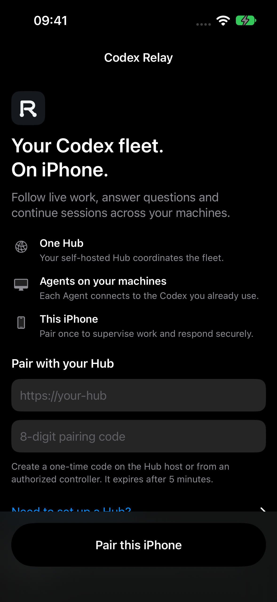

# Install and pair the iPhone client

## Download the native app without Xcode

1. Install **AltStore Classic** using its official [Mac](https://faq.altstore.io/altstore-classic/how-to-install-altstore-macos)
   or [Windows](https://faq.altstore.io/altstore-classic/how-to-install-altstore-windows)
   instructions. This first setup uses your computer and Apple account.
2. Download [CodexRelay-0.1.0-ios-unsigned.ipa](https://github.com/mothx9/codex-relay/releases/download/v0.1.0/CodexRelay-0.1.0-ios-unsigned.ipa)
   to Files on iPhone. Import it in **AltStore Classic → My Apps → +** to sign and
   install it. Relay does not receive your Apple account credentials.
3. Open Codex Relay and pair using your Hub URL and eight-digit code.

The release IPA is an unsigned iPhone/iPad device build. It needs signing before
iOS can launch it; tapping it in Files alone does not install it. With a free
Apple account, sideloaded apps [expire after seven days](https://faq.altstore.io/altstore-classic/your-altstore)
and require refresh through AltStore/AltServer. This distribution path is
documented; the release's device packaging is checked independently of an
end-to-end AltStore installation. TestFlight/App Store distribution is not yet available.

## Immediate access through Safari

For a route without signing or a computer, open the Hub's HTTPS URL in Safari,
choose **Share → Add to Home Screen**, then open Relay's Home Screen icon and
enter the one-time controller code. This is the included web/PWA interface; it
has different presentation and feature coverage from the native app. Supported
Home Screen Web Push can deliver while that web app is closed without your own
paid Apple membership. See [notifications](notifications.md).

## Building from source

Developers who clone the repository can open `native/CodexRelay.xcodeproj`, select
the `CodexRelay` scheme and their own signing team, then build/run on an authorized
iPhone. Keep personal values in the ignored `native/LocalSigning.xcconfig`.
See [native development](../development/native-ios.md).

Enable Developer Mode and trust the development app when iOS requires it. A
Personal Team can install a development build, but cannot supply the Push
Notifications capability required for real APNs delivery. The rest of Relay
works independently. See [notifications](../architecture/notifications.md).

## First launch

The app explains the three roles: Hub, machine Agents and iPhone controller.
Enter your Hub's exact HTTPS URL and the eight-digit one-time code created on the
Hub host. A code expires after five minutes. Do not enter an admin/bootstrap
token. Failed pairing is shown next to the form; the app does not automatically
retry an uncertain exchange.

Existing paired installs load their credential from Keychain. Ordinary upgrades
do not require re-pairing and must not erase this enrollment.

## Add machines and work

Open **Relay menu → Machines → Add a machine**, generate an Agent code and follow
the Linux/macOS setup guide on that machine. Run Codex normally. Fleet prioritizes
Needs You and current work. A Ready session sends a New Turn; a Working session
normally queues a Follow-up. To send that queued message to the current turn,
tap **Steer** beside it in Next up (or Escape with a physical keyboard). The
selected entry leaves the queue; other entries keep their order. Stop is the
composer button when the draft is empty; `+` is reserved for attachments.

Working rows keep the green execution state separate from the quieter activity
category, beside elapsed time. Working and Needs You use compact grouped glass
surfaces; Recent stays flat with quiet separators.
Machine/project appears to the right of the title; Recent work is a separate list.
Failed turns appear in **Errors**, with a short category. Open one to read the
exact Codex error in the conversation; a failed turn does not imply that its
terminal commands failed. Type a new message in that session to resume it.
Orange means a current decision needs you, while stale/offline work stays explicit.
Inside chat, Working belongs to the end of the transcript and scrolls away when
you read earlier messages. The composer floats over the conversation without a
solid background bar.

In a session, expand an activity group to see its latest compact rows. A command
or tool opens its own output. A single file opens its patch; a multi-file preview
opens only the changed-file list. **View all activities** opens the compact list
for that group, rather than expanding every output. See the
[inspection paths](../architecture/native-navigation.md).

Attach photos using **+ → Add photos**, or drop an image into the conversation.
Review/remove previews before sending. You can keep writing a draft even while
control is temporarily unavailable.

A current **Live question → Reply** opens options near the composer. Short
questions use a partial-height sheet you can drag larger. Choosing an option
prepares one Steer draft; it does not send until you press Send. The original
question is not repeated in the transcript while this current reply home exists.
Canonical pending decisions in Needs You remain a separate authoritative flow.

Controllers and Codex accounts are different: controllers authorize access to
Relay; Codex account information comes from the already-authenticated runtime on
your machines. Relay never creates a second OpenAI login.

TestFlight/App Store distribution requires an active Apple Developer Program
team and distribution configuration. The unsigned download does not grant the
Push Notifications entitlement; physical remote APNs acceptance remains separate.

See [current distribution and compatibility](../status.md) and
[native notification setup](notifications.md) for the remaining Apple requirements.
