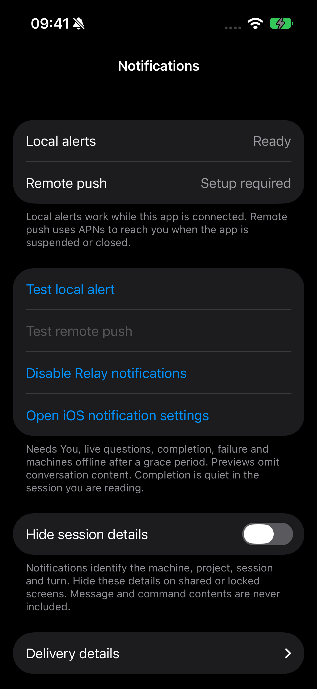

# Configure native notifications

## Connected-client local alerts

Open **Relay menu → Settings → Notifications → Allow notifications**. After the
OS permission result, the UI becomes responsive immediately while remote
registration proceeds independently. With a connected controller and permission,
**Local alerts: Ready** means observed events can produce native banners. Use
**Test local alert** to verify presentation. Disable Relay notifications here or
change system permission in iOS Settings.

By default, event banners identify machine/project, session and source turn.
Enable **Hide session details** if that metadata should not appear on the lock
screen. Message and command contents are never included.

These alerts are best effort while connected. They do not cover force quit or
arbitrary suspension. Completion in the session you are reading is quiet. Needs
You and live-question badges reflect current attention, not completed work.



## Remote push

APNs connects your Hub to Apple's push service. Pairing alone does not configure
it. First finish normal Hub/iPhone setup; notification setup preserves the same
Hub database, identity and controller enrollment.

The Apple setup is performed once by the operator/developer, not by each iPhone
user. After the app is correctly signed and the Hub is configured, permission,
device-token refresh and Relay registration are handled by the app.

Apple's [Developer Program](https://developer.apple.com/support/compare-memberships/)
costs 99 USD per membership year, with local pricing where available. This is a
developer membership fee, not a per-notification or per-controller charge.
A pending enrollment cannot yet provide the required push signing capability.
Do not purchase again if an existing payment is still processing.

For a no-membership alternative, Relay also has Web Push in its PWA. On iOS 16.4+
it requires adding the web app to the Home Screen and granting permission from
there. [WebKit documents that no Apple Developer membership is required](https://webkit.org/blog/13878/web-push-for-web-apps-on-ios-and-ipados/).
This routes to the web client and does not enable remote push for the native app.
It is a separate delivery path, not evidence of physical acceptance on your device.

## 1. Prepare the Apple capability

Use an Apple Developer team that supports Push Notifications for your app's
explicit bundle identifier. Enable that capability and regenerate the signing
profile. The signed app **and** embedded profile must contain `aps-environment`.
Do not merely add the entitlement to a Personal Team build.

Create an APNs token-authentication key authorized for the app's topic and required
environment. Record its Key ID and Team ID privately. The topic is the **actual
signed bundle identifier**, not the app's display name. Download the `.p8` key
and keep a secure backup; do not put it in Git, shell arguments or issue reports.
See Apple's [app registration](https://developer.apple.com/documentation/usernotifications/registering-your-app-with-apns)
and [provider-key instructions](https://developer.apple.com/documentation/usernotifications/establishing-a-token-based-connection-to-apns).

## 2. Configure the existing Hub

On the Hub host, securely place the key in an owner-only directory. Create a
private JSON file with these fields (replace the illustrative values locally):

```json
{
  "team_id": "TEAMID1234",
  "key_id": "KEYID12345",
  "topic": "your.signed.bundle.identifier",
  "key_file": "/absolute/private/path/AuthKey.p8"
}
```

Both identifier values must be the actual ten-character Apple identifiers.
The key path must be absolute. Set the JSON and key to mode `0600`, owned by the
Hub service user; parent directory mode `0700`. Use `vim` or your secure secret
provisioning workflow. Do not paste the key into a command line.

Build the current candidate (`make build`) and use its installer. Inspect first:

```sh
./scripts/install.sh hub --binary ./bin/codex-relay \
  --public-url "$RELAY_HUB_URL" \
  --apns-config "$HOME/.config/codex-relay/apns.json" --dry-run
```

Preserve any existing custom listen address or service options when applying the
same command without `--dry-run`. The installer retains the APNs config path
across future upgrades; `--apns-config none` explicitly disables it without
deleting the key. A manually customized service must be reviewed before replacing
its definition. Restart only the Hub service, never Codex daemons.

Expected result: Hub starts successfully and the iPhone's **Relay menu → Settings
→ Notifications** reports **Hub APNs: Configured** after reconnect. This confirms
configuration parsing, not delivery. Invalid key/identifier configuration causes
startup failure; restore the previous service invocation if needed.

## 3. Register and verify the iPhone

Install the appropriately signed app using the existing bundle identifier and
Keychain access. Open Notifications, allow iOS permission, and verify Apple
device-token and Relay-registration states. The app obtains its APNs environment
from its signature: development uses sandbox, production uses production.

Send the controller-scoped test notification. Then use an isolated validation
thread to check Needs You, completion and failure; check a safely disconnected
Agent's offline notification after grace. Verify banners, Notification Center,
badge, tap routing from foreground/background/terminated states, and a request
already resolved elsewhere. A test queued by the Hub or HTTP 200 from APNs does
not prove a visible physical notification.

[Notification architecture](../architecture/notifications.md) explains privacy,
deduplication and routing. [Current status](../status.md) records the reference
deployment's external acceptance gate.
